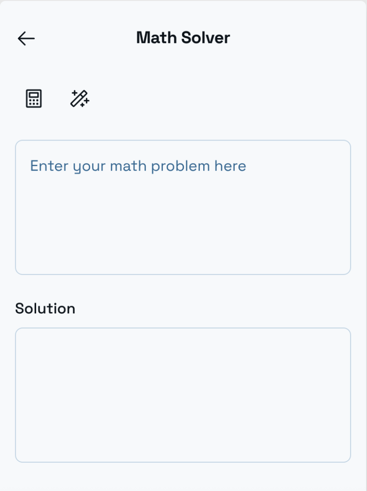

# symmath.app

## Yet another semi intelligent symbolic math calculator application

## features

    1. Symbolic algebra, calculus, linear algebra, statistics solver ✖
    2. Math notes style UI with charts ✖
    3. HTML/CSS LaTex editor ✔
    4. antlr grammar based parser generator and evaluator for asciimath and LaTex ✔
    5. Create symengine-rs Rust bindings for C++ symengine ✔
    6. Create giac-rs Rust bindings for C++ giac ✔
    7. llama.cpp based gguf model inference (math specialized models) ✔
    8. AI based OCR image to math LaTex generator for handwriting recognition ✖

## AI designed UI

 

